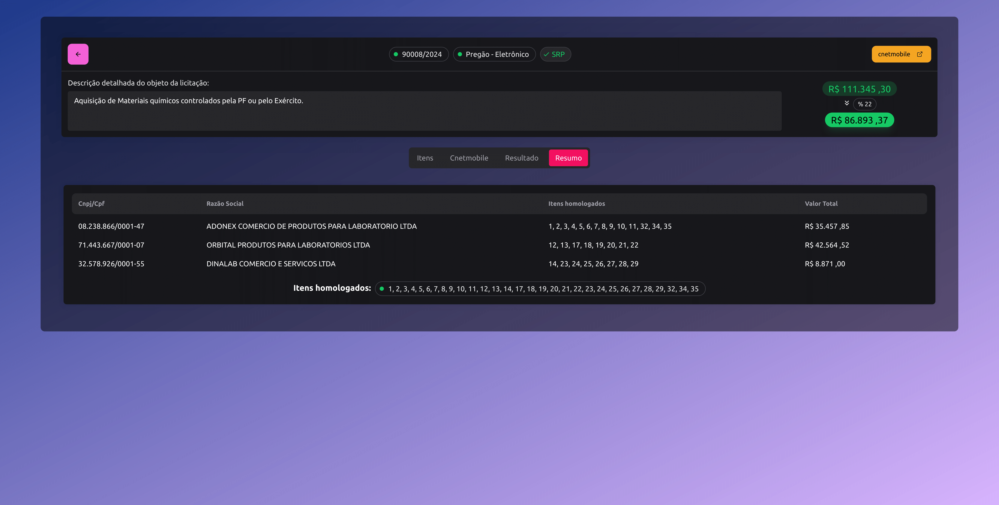

App feito em NextJs que integra informações do Portal Nacional de Contratações Públicas (PNCP), Tribunal de Contas da União (TCU) e Compras.gov.br (cnetmobile). O objetivo é consolidar informações de licitações para facilitar a manipulação dos mesmos, possibilitando a geração de certidões consolidadas do TCU, como:

- TCU | Inidôneos - Licitantes Inidôneos		
- CNJ |	CNIA - Cadastro Nacional de Condenações Cíveis por Ato de Improbidade Administrativa e Inelegibilidade		
- Portal da Transparência	| CEIS - Cadastro Nacional de Empresas Inidôneas e Suspensas		
- Portal da Transparência | CNEP - Cadastro Nacional de Empresas Punidas

e automações como:

- geração de planilhas;
- análise de dados;
- elaboração de documentos como atas de registro de preço;
- textos para publicação em diário oficial.

  # ScreenShots

**Certidões do tribunal de contas da união em massa**

**Editais de licitações dado uma uasg**

**Itens de uma licitação**

**Resumo do resultado final da licitação**

